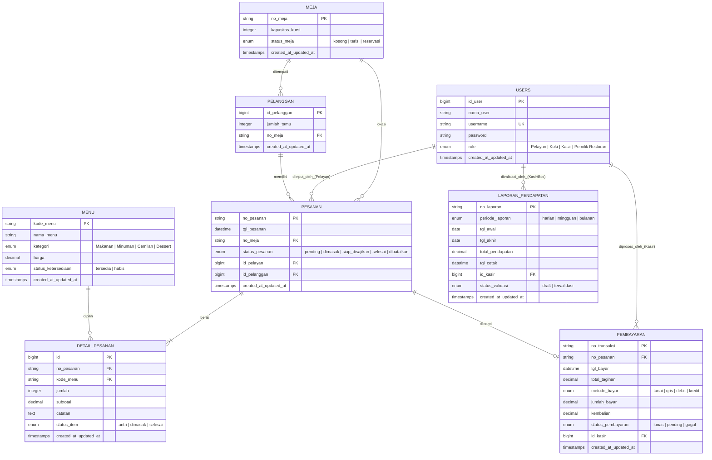
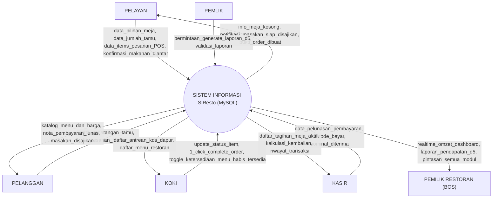
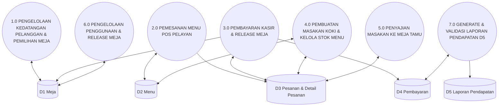

# DOKUMEN PERANCANGAN PERANGKAT LUNAK

<div align="center">

### SISTEM INFORMASI MANAJEMEN RESTORAN (SIResto)
**BERBASIS LARAVEL 11, TAILWIND CSS, DAN MYSQL DATABASE**

<br>

**Disusun oleh:**

| Nama | NIM |
| :--- | :--- |
| **Alexsis Askar Cheluva** | 10124182 |
| **Nitto Novero** | 10124183 |
| **Kadek Sudarsana** | 10124187 |
| **Rizkya Gusnaldy Kalia** | 10124190 |
| **Farhan Naufal Ardiansyah** | 10124198 |

<br>

**Kelas:** IF-5

<br>

**PROGRAM STUDI TEKNIK INFORMATIKA**  
**FAKULTAS TEKNIK DAN ILMU KOMPUTER**  
**UNIVERSITAS KOMPUTER INDONESIA**  
**BANDUNG**  
**2026**

</div>

---

## 1. Pendahuluan

Penyusunan Dokumen Perancangan Perangkat Lunak ini bertujuan untuk memberikan gambaran menyeluruh mengenai rancangan sistem informasi manajemen restoran (**SIResto**) yang telah dikembangkan, mulai dari kebutuhan fungsional, alur proses bisnis, hingga interaksi antar pengguna di dalam sistem. Dokumen ini disusun sebagai acuan teknis dalam implementasi dan pemeliharaan perangkat lunak, sehingga sistem dapat berjalan secara terarah, konsisten, dan sesuai dengan kebutuhan operasional restoran yang telah ditetapkan.

Secara lebih khusus, perancangan sistem ini bertujuan untuk menyederhanakan dan mengotomatisasi proses operasional restoran yang selama ini masih banyak dilakukan secara manual, sehingga rawan terjadi kesalahan pencatatan pesanan maupun keterlambatan komunikasi antar bagian. Melalui sistem **SIResto** yang dirancang, setiap pengguna—baik **Pemilik Restoran (Manager/Bos)**, **Pelayan**, **Koki**, maupun **Kasir**—memiliki peran (*role*) dan wewenang akses masing-masing yang telah disesuaikan dengan tanggung jawabnya. Alur kerja mulai dari proses pendaftaran meja dan input order POS oleh pelayan, pengolahan masakan di dapur oleh koki (dilengkapi *1-click complete order*), penyajian makanan, hingga proses pembayaran dan pengosongan meja oleh kasir dapat berjalan secara terintegrasi dan efisien.

Selain itu, perancangan ini juga bertujuan untuk memberikan kemudahan bagi pihak manajemen dalam memantau dan mengelola jalannya operasional restoran secara *real-time*, seperti pemantauan omzet harian serta pembuatan dan validasi Laporan Pendapatan (Data Store D5). Seluruh arsitektur data **SIResto** diintegrasikan secara penuh menggunakan **MySQL Database** (MariaDB / MySQL 8.0) untuk menjamin performa tinggi, keandalan relasi antar tabel, dan skala transaksi besar.

---

## 2. Perancangan Database

Perancangan database pada **SIResto** dirancang menggunakan arsitektur basis data relasional **MySQL** yang presisi mematuhi aturan **ERD Ground Truth**. Struktur database menjamin normalisasi entitas, keutuhan *Foreign Key*, serta keandalan transaksi atomic (`DB::transaction`).

### Konfigurasi Environment (`.env`)

```env
APP_NAME=SIResto
APP_ENV=local
APP_KEY=base64:mbsBbcVRvhwIlssPXdnAOAu/rrd0Gh1By9b+zZ/HgTY=
APP_DEBUG=true
APP_TIMEZONE=Asia/Jakarta
APP_URL=http://localhost:8000

LOG_CHANNEL=stack
LOG_STACK=single
LOG_DEPRECATIONS_CHANNEL=null
LOG_LEVEL=debug

# Koneksi Database Utama SIResto (MySQL)
DB_CONNECTION=mysql
DB_HOST=127.0.0.1
DB_PORT=3306
DB_DATABASE=siresto
DB_USERNAME=root
DB_PASSWORD=

# Sesi HTTP Pengguna (Database Session Persistence)
SESSION_DRIVER=database
SESSION_LIFETIME=120
```

---

## 3. Stack

Tabel berikut mendeskripsikan kombinasi teknologi dan perangkat lunak yang digunakan dalam perancangan serta pembangunan aplikasi **SIResto**:

| Kebutuhan | Stack Teknologi / Perangkat Lunak |
| :--- | :--- |
| **Design Diagram** | draw.io & Canva |
| **UI/UX Design** | Figma |
| **Frontend + Backend Framework** | **Laravel 11** (Blade Templates, Vite, & **Tailwind CSS**) |
| **Database Engine** | **MySQL Database** (MariaDB 10.4 / MySQL 8.0 - Database `siresto`) |

---

## 4. Perancangan Data

### Gambar 2 ERD (Entity Relationship Diagram)

Diagram ERD berikut menggambarkan 8 entitas utama dalam sistem **SIResto** beserta atribut dan relasinya pada MySQL Database:



---

### Gambar 3 Skema Relasional

Struktur tabel relasional database **MySQL `siresto`** secara lengkap:

```text
+-------------------------------------------------------------------------------+
|                                     USERS                                     |
+-------------------+-------------------+-------------------+-------------------+
| id_user (PK)      | nama_user         | username (Unique) | password          |
| role (Enum)       | timestamps        |                   |                   |
+-------------------+-------------------+-------------------+-------------------+
          │                                   │                   │
          │ 1:N (id_pelayan)                  │ 1:N (id_kasir)    │ 1:N (id_kasir)
          ▼                                   ▼                   ▼
+-------------------+                   +-------------------+   +-------------------+
|      PESANAN      |                   |    PEMBAYARAN     |   |LAPORAN_PENDAPATAN |
+-------------------+                   +-------------------+   +-------------------+
| no_pesanan (PK)   |                   | no_transaksi (PK) |   | no_laporan (PK)   |
| tgl_pesanan       |                   | no_pesanan (FK)   |   | periode_laporan   |
| no_meja (FK)      |                   | tgl_bayar         |   | tgl_awal, tgl_akh |
| status_pesanan    |                   | total_tagihan     |   | total_pendapatan  |
| id_pelayan (FK)   |                   | metode_bayar      |   | tgl_cetak         |
| id_pelanggan (FK) |                   | jumlah_bayar      |   | id_kasir (FK)     |
+---------┬---------+                   | kembalian         |   | status_validasi   |
          │                             | status_pembayaran |   +-------------------+
          │ 1:N                         | id_kasir (FK)     |
          ▼                             +-------------------+
+-------------------+
|  DETAIL_PESANAN   |
+-------------------+
| id (PK)           |
| no_pesanan (FK)   |
| kode_menu (FK)    |◄────────┐ 1:N
| jumlah            |         │
| subtotal          |   +-----+-------------+
| catatan           |   |       MENU        |
| status_item       |   +-------------------+
+-------------------+   | kode_menu (PK)    |
                        | nama_menu         |
                        | kategori (Enum)   |
                        | harga             |
                        | status_ketersedia |
                        +-------------------+

+-------------------+           +-------------------+
|       MEJA        | 1:N       |     PELANGGAN     |
+-------------------+──────────►+-------------------+
| no_meja (PK)      |           | id_pelanggan (PK) |
| kapasitas_kursi   |           | jumlah_tamu       |
| status_meja       |           | no_meja (FK)      |
+-------------------+           +-------------------+
```

---

## 5. Perancangan Proses (Fungsional) / DFD

### Gambar 4 Konteks Diagram

Diagram Konteks menggambarkan batasan aplikasi **SIResto** dengan 5 entitas luar (*Pelayan*, *Pelanggan*, *Koki*, *Kasir*, dan *Pemilik Restoran/Manager*):



---

### Gambar 5 DFD Level 0

Overview diagram aliran data antar 7 proses utama SIResto dan 5 Data Store di MySQL (`D1 Meja`, `D2 Menu`, `D3 Pesanan & Detail Pesanan`, `D4 Pembayaran`, `D5 Laporan Pendapatan`):



---

### Gambar 6 DFD Level 1 Figure 1-2

#### Proses 1.0 (Alokasi Meja Pelanggan) & Proses 2.0 (Pemesanan POS Pelayan):
- **1.1 Verifikasi Autentikasi Pelayan**: Memeriksa kredensial login akun pelayan.
- **1.2 Cek Ketersediaan Meja Kosong**: Mengambil data meja bertatus `kosong` dari `D1 Meja`.
- **1.3 Tentukan Alokasi & Jumlah Tamu**: Mencatat data `pelanggan` dan mengubah status meja menjadi `terisi`.
- **2.1 Tampilkan Katalog Menu POS**: Memanggil seluruh katalog dari `D2 Menu`. Menu bertatus `habis` tetap ditampilkan dengan badge `🔴 STOK HABIS` dan tombol `+` terkunci.
- **2.2 Pilih Menu & Input Kuantitas Selektif**: Pelayan memilih menu masakan (bisa pesan 1 item saja).
- **2.3 Eksekusi Transaksi Atomic MySQL**: Menyimpan header ke `D3 Pesanan` dan item terpilih ke `detail_pesanan` dalam 1 blok `DB::transaction`.

---

### Gambar 7 DFD Level 1 Figure 3-6

#### Proses 3.0 (Pembayaran Kasir), 4.0 (KDS Koki), 5.0 (Penyajian), & 6.0 (Release Meja):
- **3.1 Panggil Tagihan Aktif Meja**: Kasir memilih kartu meja yang selesai makan dari `D3 Pesanan`.
- **3.2 Hitung Total Tagihan & Kembalian**: Menghitung total tagihan dan kembalian berdasarkan nominal uang diterima.
- **3.3 Simpan Pelunasan & Kosongkan Meja**: Menyimpan entri ke `D4 Pembayaran`, mengubah `status_pesanan` ke `selesai`, serta melepaskan meja di `D1 Meja` kembali ke status `kosong`.
- **4.1 Layar Antrean Dapur KDS**: Koki memantau antrean masakan masuk dari `D3 Pesanan`.
- **4.2 1-Click Complete Masakan**: Koki menekan tombol `✅ MASAKAN SELESAI` untuk menyelesaikan seluruh order meja seketika.
- **4.3 Kelola Stok Bahan Baku**: Koki mengubah status menu menjadi `Set Habis ❌` jika stok bahan di dapur kosong.
- **5.1 Banner Alert Siap Diantar**: Pelayan menerima notifikasi masakan matang di layar `/pelayan/ready`.
- **5.2 Konfirmasi Penyajian**: Pelayan menekan tombol `🍽️ Tandai Telah Diantar`.

---

### Gambar 8 DFD Level 1 Figure 7

#### Proses 7.0 (Generate & Validasi Laporan Pendapatan D5):
- **7.1 Permintaan Laporan Pemilik**: Pemilik Restoran memilih periode laporan (*Harian, Mingguan, Bulanan*).
- **7.2 Akumulasi Omzet Lunas**: Sistem menghitung total dari data store `D4 Pembayaran` bertatus `lunas`.
- **7.3 Simpan & Validasi Laporan**: Menyimpan record resmi ke data store `D5 Laporan Pendapatan` dengan status `tervalidasi`.
- **7.4 Tampilkan Executive Dashboard**: Menyajikan grafik omzet dan pintasan VIP ke seluruh modul sistem.

---

## 6. UI/UX (Antarmuka Pengguna SIResto)

Rancangan UI/UX **SIResto** dibangun menggunakan **Laravel Blade Templates & Tailwind CSS** yang responsif, *clean*, dan berkinerja tinggi.

---

### Gambar 9 Halaman Login Pegawai Multirole
  
*Gambar 9 Halaman Login Pegawai (`/login`)*  
Halaman login terpusat untuk ke-4 role (*Pelayan, Koki, Kasir, Pemilik Restoran*) yang dilengkapi tombol pintasan akun demo.

---

### Gambar 10 Halaman Executive Dashboard - Pemilik Restoran (Bos)
  
*Gambar 10 Halaman Executive Dashboard (`/pemilik/dashboard`)*  
Monitoring omzet harian *real-time*, total pesanan diproses, serta ketersediaan menu aktif.

---

### Gambar 11 Halaman Form Generate Laporan Pendapatan D5 - Pemilik Restoran
  
*Gambar 11 Halaman Form Generate & Validasi Laporan Pendapatan (`/pemilik/dashboard`)*  
Fitur tombol `⚡ Generate Laporan` (Harian, Mingguan, Bulanan) untuk membuat dan memvalidasi record Data Store D5 di MySQL.

---

### Gambar 12 Halaman Pintasan Navigasi VIP All Modules - Pemilik Restoran
  
*Gambar 12 Halaman Pintasan Navigasi VIP All Modules*  
Panel tombol akses cepat bagi Pemilik Restoran untuk melompat langsung ke modul Pelayan, Koki, maupun Kasir.

---

### Gambar 13 Halaman Form Pemesanan POS - Pelayan
  
*Gambar 13 Halaman Form Pemesanan POS Pelayan (`/pelayan/order`)*  
Antarmuka 2-kolom pelayan: Pemilihan No. Meja Kosong, Jumlah Tamu, dan Katalog Menu POS.

---

### Gambar 14 Halaman Filter Kategori Menu Tab - Pelayan
  
*Gambar 14 Halaman Filter Kategori Menu Tab*  
Tab filter instan (*Semua, Makanan, Minuman, Cemilan, Dessert*) untuk mempermudah pencarian masakan.

---

### Gambar 15 Halaman Menu Stok Habis (Red Badge 🔴 STOK HABIS & Lock Input) - Pelayan
  
*Gambar 15 Halaman Menu Stok Habis*  
Menu yang bahan bakunya kosong tetap ditampilkan dengan Badge `🔴 STOK HABIS` dan tombol `+`/`-` dikunci (*disabled*).

---

### Gambar 16 Halaman Cart Summary & Estimasi Tagihan - Pelayan
  
*Gambar 16 Halaman Cart Summary & Estimasi Tagihan*  
Sidebar keranjang belanja *real-time* yang menghitung kuantitas dan total estimasi tagihan sebelum dikirim ke dapur.

---

### Gambar 17 Halaman Banner Notifikasi Masakan Siap Diantar - Pelayan
  
*Gambar 17 Halaman Banner Notifikasi Masakan Siap Diantar*  
Banner alert hijau di layar pelayan yang menginfokan masakan matang di dapur dan siap diantar ke meja tamu.

---

### Gambar 18 Halaman Konfirmasi Makanan Diantar ke Meja - Pelayan
  
*Gambar 18 Halaman Konfirmasi Makanan Diantar ke Meja (`/pelayan/ready`)*  
Layar khusus pelayan untuk mengonfirmasi bahwa makanan telah diantar ke meja pelanggan.

---

### Gambar 19 Halaman Kitchen Display System (KDS) - Koki
  
*Gambar 19 Halaman Kitchen Display System / KDS (`/koki/kds`)*  
Layar antrean dapur koki dengan nomor meja besar, kuantitas kontras tinggi, dan rincian catatan kustom.

---

### Gambar 20 Halaman 1-Click Tombol Masakan Selesai per Meja - Koki
  
*Gambar 20 Halaman 1-Click Tombol Masakan Selesai per Meja*  
Tombol hijau utama `✅ MASAKAN SELESAI (SIAP SAJI)` yang menyelesaikan seluruh order meja dalam 1 kali klik.

---

### Gambar 21 Halaman Kelola Stok Menu & Ketersediaan Bahan Baku - Koki
  
*Gambar 21 Halaman Kelola Stok Menu & Ketersediaan Bahan Baku (`/koki/menu`)*  
Panel khusus koki untuk mengontrol ketersediaan stok bahan baku masakan di dapur.

---

### Gambar 22 Halaman Toggle Status Menu (Tersedia vs Habis) - Koki
  
*Gambar 22 Halaman Toggle Status Menu*  
Tombol instan `Set Habis ❌` dan `Set Tersedia ✅` untuk mengubah status ketersediaan menu secara *real-time*.

---

### Gambar 23 Halaman Tambah Menu Baru Dapur - Koki
  
*Gambar 23 Halaman Tambah Menu Baru Dapur*  
Form penambahan masakan atau variasi resep baru ke dalam katalog database MySQL oleh koki.

---

### Gambar 24 Halaman Checkout POS Pelunasan Pembayaran - Kasir
  
*Gambar 24 Halaman Checkout POS Pelunasan Pembayaran (`/kasir/pos`)*  
Panel checkout pelunasan tagihan kasir dengan kartu meja aktif yang menunggu pembayaran.

---

### Gambar 25 Halaman Pemilihan Kartu Meja Active Unpaid - Kasir
  
*Gambar 25 Halaman Pemilihan Kartu Meja Active Unpaid*  
Pemilihan kartu meja aktif yang secara otomatis mengisi nomor pesanan dan total tagihan ke form checkout.

---

### Gambar 26 Halaman Preset Uang Tunai (Pas, 50k, 100k) & Kalkulator Kembalian - Kasir
  
*Gambar 26 Halaman Preset Uang Tunai & Kalkulator Kembalian*  
Tombol cepat nominal pembayaran tunai dan kalkulasi otomatis jumlah kembalian pelanggan.

---

### Gambar 27 Halaman Release Status Meja Otomatis Kembali Kosong - Kasir
  
*Gambar 27 Halaman Release Status Meja Otomatis Kembali Kosong*  
Begitu transaksi dilunasi, status pesanan diubah ke `selesai` dan status meja di `D1 Meja` otomatis kembali `kosong`.

---

### Gambar 28 Halaman Riwayat Transaksi Pembayaran & Log Struk - Kasir
  
*Gambar 28 Halaman Riwayat Transaksi Pembayaran (`/kasir/history`)*  
Tabel log riwayat seluruh transaksi pelunasan pembayaran lengkap dengan timestamp dan kasir penanggung jawab.

---

### Gambar 29 Halaman Portal Welcome Navigasi Role
  
*Gambar 29 Halaman Portal Welcome Navigasi Role (`/`)*  
Halaman portal selamat datang yang menampilkan informasi navigasi dan pengenalan aplikasi **SIResto**.
