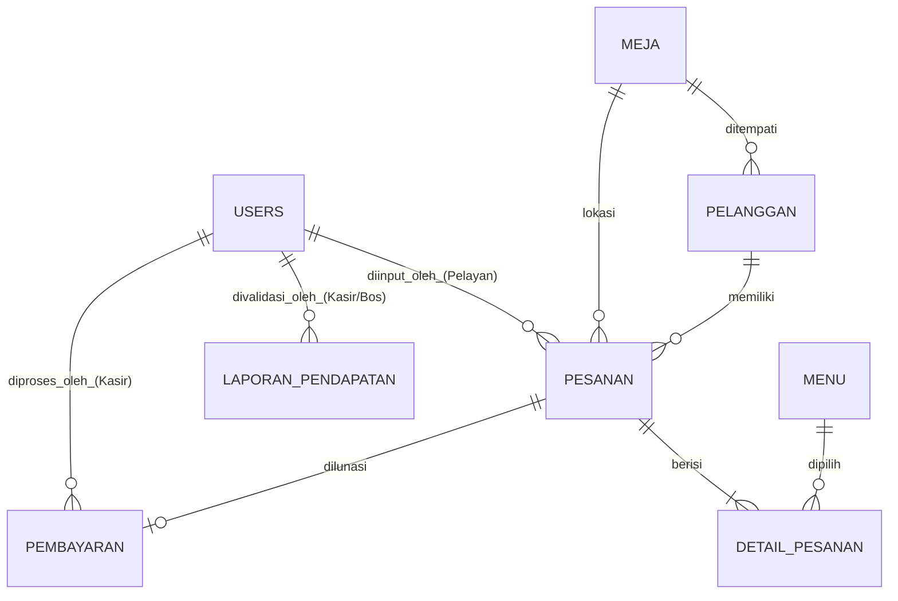

# 🍽️ SIResto — Sistem Informasi Management Restaurant

<div align="center">


**SIResto** adalah Sistem Informasi Manajemen Restoran & Point of Sale (POS) Enterprise berbasis **Laravel 11, Tailwind CSS, dan MySQL Database**.

</div>

---

> [!NOTE]  
> **Arsitektur Ground Truth**: SIResto dirancang presisi mematuhi ERD 8 Tabel Utama dan mengoreksi total inkonsistensi DFD lama (pemisahan D3 Pesanan, D4 Pembayaran, dan penanganan D2 Ketersediaan Stok Bahan Baku oleh Koki).

---

## ⚡ Quick Start (Cara Cepat Menjalankan)

> [!IMPORTANT]
> **Prasyarat Instalasi**: Pastikan server **MySQL (XAMPP / Laragon)** aktif pada port `3306`.

### 1. Migrasi Pertama Kali (Hanya 1x Saat Clone / Install Baru)
Jika Anda baru pertama kali mengunduh / meng-clone repositori ini di komputer baru, jalankan perintah migrasi & seed untuk membuat database `siresto` beserta data awal sampel:
```powershell
.\migrate
```
*(Atau jalankan `php artisan migrate:fresh --seed`)*.

---

### 2. Menjalankan Aplikasi (Penggunaan Sehari-hari)
Cukup jalankan server lokal:
```powershell
.\serve
```
*(Atau klik 2x file `serve.bat` di folder proyek)*.

Buka browser di: **[http://127.0.0.1:8000](http://127.0.0.1:8000)**

---

## 🔑 Akun Demo Pengujian (Demo Credentials)

> [!IMPORTANT]  
> Password global untuk seluruh akun demo adalah: **`password`**

| Role / Jabatan | Username | Password | URL Modul Utama | Sub-Proses Navigation |
| :--- | :--- | :--- | :--- | :--- |
| 📋 **Pelayan** | `pelayan1` | `password` | `/pelayan/order` | Order POS & Notifikasi Makanan Matang |
| 👨‍🍳 **Koki** | `koki1` | `password` | `/koki/kds` | KDS Antrean Dapur & Kelola Stok Menu |
| 💳 **Kasir** | `kasir1` | `password` | `/kasir/pos` | Checkout POS Pelunasan & Release Meja |
| 📊 **Pemilik (Bos)** | `pemilik1` | `password` | `/pemilik/dashboard` | Executive Overview & Validasi Laporan D5 |

---

## 🏢 Alur Kerja & Fitur Berdasarkan Role

<details>
<summary>📋 <b>1. Role Pelayan (Waiter POS & Ready Notification)</b></summary>

<br>

- **Form Pemesanan POS (`/pelayan/order`)**:
  - Pendaftaran Alokasi Meja Kosong & Jumlah Tamu.
  - Katalog Menu Visual dengan Filter Tab Kategori (*Makanan, Minuman, Cemilan, Dessert*).
  - Pemesanan Selektif (Bisa pesan 1 item saja tanpa harus memilih semua menu).
  - Menu bertatus `🔴 STOK HABIS` otomatis dikunci (*disabled*) dan tidak dapat ditambahkan.
  - Input Catatan Kustom per item masakan (misal: *Pedas sedang*).
- **Layar Notifikasi Masakan Matang (`/pelayan/ready`)**:
  - Banner Alert Notifikasi Hijau *real-time* saat Koki menyelesaikan masakan di dapur.
  - Tombol **`🍽️ Konfirmasi Makanan Telah Diantar ke Meja`**.

</details>

<details>
<summary>👨‍🍳 <b>2. Role Koki (Kitchen Display System & Ingredient Stock)</b></summary>

<br>

- **Layar Antrean Dapur / KDS (`/koki/kds`)**:
  - Tampilan KDS kontras tinggi dengan nomor meja besar & kuantitas jernih.
  - **1-Click Order Complete**: Cukup 1 tombol hijau `✅ MASAKAN SELESAI (SIAP SAJI)` untuk menyelesaikan seluruh order meja.
- **Kelola Stok Menu & Bahan Baku (`/koki/menu`)**:
  - Pengubah status instan `Set Habis ❌` dan `Set Tersedia ✅` jika bahan baku di dapur kosong.
  - Form **`➕ Tambah Menu Baru`** untuk mendaftarkan variasi resep baru.

</details>

<details>
<summary>💳 <b>3. Role Kasir (POS Checkout & Auto-Release Table)</b></summary>

<br>

- **Checkout POS Pelunasan (`/kasir/pos`)**:
  - Pemilihan kartu meja aktif yang menunggu pembayaran.
  - Metode Bayar Lengkap (*Tunai, QRIS, Debit, Kredit*).
  - Preset Uang Tunai Cepat (*Pas, 50k, 100k*) & Kalkulator Kembalian Otomatis.
  - Release Meja Otomatis: Begitu dilunasi, meja di Data Store `D1 Meja` otomatis kembali `kosong`.
- **Riwayat Transaksi & Log (`/kasir/history`)**:
  - Rekapitulasi log seluruh transaksi pembayaran lunas lengkap dengan timestamp dan kasir penanggung jawab.

</details>

<details>
<summary>📊 <b>4. Role Pemilik Restoran / Manager (Executive Dashboard)</b></summary>

<br>

- **Executive Dashboard Overview (`/pemilik/dashboard`)**:
  - Pemantauan Omzet Harian, Total Order Diproses, dan Menu Aktif.
- **Generate & Validasi Laporan Pendapatan D5**:
  - Fitur tombol **`⚡ Generate Laporan`** (*Harian, Mingguan, Bulanan*) untuk merekap data omzet lunas ke Data Store D5.
- **Pintasan VIP All Modules**:
  - Tombol akses cepat ke modul Pelayan, Koki, maupun Kasir.

</details>

---

## 🗄️ Database Schema Matrix (8 Tabel Utama MySQL)

Sistem database SIResto berjalan menggunakan **MySQL Engine** (`DB_CONNECTION=mysql`, database `siresto`):



| Nama Tabel | Fungsi Data Store | Kunci Utama (PK) | Kunci Asing (FK) | Status / Enum Utama |
| :--- | :--- | :--- | :--- | :--- |
| **`users`** | Pegawai & Hak Akses | `id_user` | - | `role` (Pelayan, Koki, Kasir, Pemilik) |
| **`meja`** | Data Store D1 (Meja) | `no_meja` | - | `status_meja` (kosong, terisi, reservasi) |
| **`menu`** | Data Store D2 (Katalog) | `kode_menu` | - | `status_ketersediaan` (tersedia, habis) |
| **`pelanggan`** | Data Kedatangan Tamu | `id_pelanggan` | `no_meja` | `jumlah_tamu` |
| **`pesanan`** | Data Store D3 (Header) | `no_pesanan` | `no_meja`, `id_pelayan`, `id_pelanggan` | `status_pesanan` (pending, dimasak, siap_disajikan, selesai) |
| **`detail_pesanan`** | Detail Item Masakan | `id` | `no_pesanan`, `kode_menu` | `status_item` (antri, dimasak, selesai) |
| **`pembayaran`** | Data Store D4 (Pelunasan) | `no_transaksi` | `no_pesanan`, `id_kasir` | `status_pembayaran` (lunas, pending) |
| **`laporan_pendapatan`** | Data Store D5 (Laporan) | `no_laporan` | `id_kasir` | `status_validasi` (draft, tervalidasi) |

---

## 📑 Dokumen Perancangan Perangkat Lunak (DPPL)

Dokumen resmi perancangan sistem berbasis **Template UNIKOM 2026** tersedia dalam repositori ini:

- 📝 **[Dokumen Perancangan Perangkat Lunak (.md)](DOKUMEN_PERANCANGAN_PERANGKAT_LUNAK.md)**

---

## 🛠️ Catatan Pemeliharaan & Reset Database

Jika ingin mereset database MySQL ke kondisi awal bersih dengan seeder sampel:
```powershell
.\migrate
```
*(Atau `php artisan migrate:fresh --seed`)*.

---

<div align="center">

**SIResto Enterprise POS System &copy; 2026** — *Developed with Laravel 11, Tailwind CSS, & MySQL*

</div>